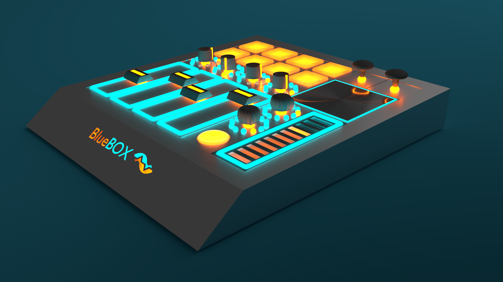

# BlueBox
A fully modular MIDI controller I designed in 2016. I worked on this business for about 8 months, building prototypes and working with the Denver SBDC (Small Business Development Center) to figure out how to get the company going. 

## Concept:
#### - Have a main base unit, offered in several sizes with differing numbers of slots
#### - The "slots" are just sets of magnets and pogo-pins on the base unit, that make up a grid of squares.
#### - Modules are offered for each different control type, and take up varying numbers of slots. See below for a list of module types.
#### - Artists could configure their controler to fit their needs for any given task, meaning that they would only need one controller with dynamic functionality, rather than several controllers, each for a different task.

## Modules:
### Classic Fader
### Touch Fader
### Classic Knob
### Rotary Encoder
### Button
### Velocity Sensitive Drum Pad
### Joystick
### XY Touchpad
### Joystick
### Pichbend
### Modulation Wheel
### Breath Controller
### Keyboard Module (Attaches to front, not into a slot)

This is the second iteration design I made in Blender. This View shows a couple of the components removed.
