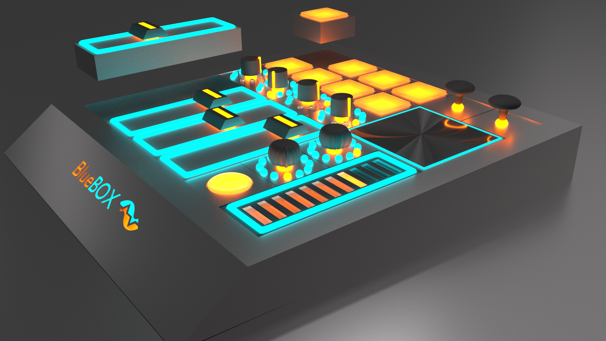

# BlueBox
A fully modular MIDI controller I designed in 2016. I worked on this product idea for about 9 months, building prototypes and working with the Denver SBDC (Small Business Development Center) to figure out how to get the company going. This project has been on put on the shelf for the time being. I hope to continue with it in the future.

.png)
Here is the 2nd iteration of the 6x6 model with only a fader, touch-fader, drum pad, xy-touchpad, joystick, classic knob, and rotary encoder installed.

.png)
Here is a different rendering of the same model fully filled.

.png)
Here is the same version with no modules installed

## Concept:
#### - Offer main base unit in several sizes, with differing numbers of slots (6x6, 9x9, & 12x12)
#### - The "slots" are just sets of magnets/clips and pogo-pin connections on the base unit, making up a grid.
#### - Modules are offered for each different control type, and take up varying numbers of slots. See below for a list of module types.
#### - Artists could configure their controler to fit their needs for any given task, meaning that they would only need one controller with dynamic functionality, rather than several controllers, each for a different task.

## Modules:
### Classic Fader
### Touch Fader
### Classic Knob
### Rotary Encoder
### Button
### Velocity Sensitive Drum Pad
### Joystick
### XY Touchpad
### Joystick
### Pichbend
### Modulation Wheel
### Breath Controller
### Keyboard Module (Attaches to front, not into a slot)

## Also Considered
### Audio input/output modules, turning it into an audio interface
### Synthesizer modules (sort of like littlebits style synth units)
### Screen modules (touch or otherwise)

This is the second iteration design I made in Blender. This View shows a couple of the components removed.
